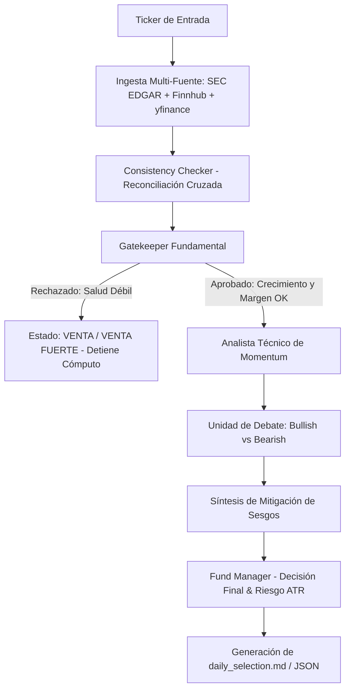

# 🚀 Sistema Multi-Agente Financiero (LangGraph + Open Source MAS)

Un **Pipeline de Selección de Élite** para el análisis integral de acciones bursátiles y generación de recomendaciones clasificadas en **5 categorías estrictas**:
1. 🟢 **COMPRA FUERTE** (Strong Buy)
2. 🟩 **COMPRA** (Buy)
3. 🟡 **MANTENER** (Hold)
4. 🔴 **VENTA** (Sell)
5. 🛑 **VENTA FUERTE** (Strong Sell)

Basado en el **Patrón de Orquestación Jerárquica con Estados de Control (State Machine)** mediante **LangGraph**, **Docker** y soporte nativo para **Hugging Face (Open Source)**.

---

## 📌 ¿De qué va el Proyecto?

El sistema organiza agentes analíticos especializados en un flujo condicional de decisiones:



### Componentes Principales

* 🏛️ **Ingesta Multi-Fuente & Consistency Checker**: Extrae datos auditados directamente de la **SEC EDGAR API (10-K/10-Q)**, **Finnhub API** e **yfinance**. Valida consistencia cruzada y calcula un índice de confianza en los datos.
* 🛡️ **Gatekeeper Fundamental (Filtro Inteligente)**: Evalúa crecimiento de ingresos, margen neto y relación deuda/capital. Si la empresa no aprueba la salud básica, detiene el flujo para evitar el gasto computacional de análisis técnicos innecesarios.
* 📈 **Analista Técnico de Momentum (Technical ISA)**: Analiza **RSI (14)**, **MACD (12, 26, 9)**, **Bandas de Bollinger**, **Medias Móviles (SMA 50/200)** y **ATR (14)**.
* ⚖️ **Capa de Debate & Mitigación de Sesgos**: Confrontación entre un **Bullish Researcher** y un **Bearish Researcher** (Abogado del Diablo) para evitar el sesgo de confirmación.
* 💼 **Fund Manager**: Emite el dictamen final, calcula el porcentaje de cartera recomendado (%) y establece parámetros de riesgo basados en volatilidad ATR (**Stop-Loss** y **Take-Profit**).

---

## ⚙️ Configuración del Entorno (`.env`)

Copia el archivo de ejemplo `.env.example` a `.env` y ajusta los parámetros deseados:

```bash
cp .env.example .env
```

### Configuración del Proveedor LLM (Open Source & Multi-Provider)
Puedes elegir entre **Hugging Face**, Ollama, OpenAI, Google Gemini o un motor analítico heurístico local:

```ini
# Opciones de LLM_PROVIDER: "huggingface", "openai", "gemini", "ollama", "heuristic"
LLM_PROVIDER=huggingface

# Configuración de Hugging Face (Open Source Recomendado)
HUGGINGFACEHUB_API_TOKEN=tu_token_de_huggingface_aqui
HUGGINGFACE_MODEL=meta-llama/Meta-Llama-3-8B-Instruct

# Configuración de Finnhub API (Opcional para ratios extendidos)
FINNHUB_API_KEY=tu_api_key_de_finnhub

# Identificación para la API oficial de SEC EDGAR
SEC_EDGAR_USER_AGENT=FinancialAnalystAgent/1.0 (contact@ejemplo.com)

# Umbrales del Gatekeeper Fundamental
MIN_REVENUE_GROWTH=0.05    # 5% mínimo de crecimiento YoY
MIN_NET_MARGIN=0.03        # 3% mínimo de margen neto
MAX_DEBT_TO_EQUITY=3.5     # Límite máximo Deuda/Capital
```

---

## 🚀 Formas de Arrancar el Proyecto

### 1️⃣ Método 1: Línea de Comandos (CLI)
Ejecuta el análisis por lotes directamente en la terminal:

```bash
python cli.py --tickers NVDA,AAPL,TSLA,INTC
```
El informe Markdown ejecutivo se guardará automáticamente en `./output/daily_selection.md`.

---

### 2️⃣ Método 2: Dashboard Web Interactivo (FastAPI + Glassmorphism)
Inicia el servidor web interactivo:

```bash
python -m src.web.app
```

Abre tu navegador en:
👉 `http://localhost:8000`

Accederás a la interfaz futurista dark mode donde podrás ingresar tickers, ver el progreso de los agentes en tiempo real y consultar los gráficos de recomendaciones.

---

### 3️⃣ Método 3: Despliegue con Docker / Docker Compose
Para aislar operacionalmente la aplicación en contenedores reproducibles:

```bash
docker-compose up --build
```

El panel web estará disponible en `http://localhost:8000` y los informes generados se montarán automáticamente en la carpeta local `./output/`.

---

## 📉 Backtesting: ¿ha sido rentable el sistema?

`src/backtest/` es una capa **de solo lectura** que reproduce las decisiones del
sistema sobre datos históricos. No reimplementa ninguna regla: importa y ejecuta
los agentes reales de `src/agents/` sobre estados reconstruidos fecha a fecha.

```bash
# Resultado principal: fundamentales point-in-time desde SEC EDGAR
python backtest_cli.py --start 2015-01-01 --end 2025-12-31 --regime pit

# Aislar la capa técnica (gatekeeper fundamental neutralizado)
python backtest_cli.py --regime technical_only

# Contraste con look-ahead: fundamentales de hoy aplicados al pasado
python backtest_cli.py --regime biased
```

La primera ejecución descarga precios y `companyfacts` de la SEC a `data/cache/`
(~250 MB). A partir de ahí, `--offline` reproduce el estudio sin red y bit a bit
idéntico.

**Tres regímenes de datos, porque el sesgo de look-ahead determina el resultado:**

| Régimen | Fundamentales | Uso |
|---|---|---|
| `pit` | SEC EDGAR filtrado por `filed <= t` | Resultado principal, insesgado |
| `technical_only` | Gatekeeper desactivado | Aísla el valor de la capa técnica |
| `biased` | `yfinance.info` de HOY | Mide cuánto infla el look-ahead |

Salidas en `output/`: `backtest_report.md`, `backtest_results.json`, curvas de
capital y drawdown en PNG, y el detalle de operaciones en CSV.

### Resultados (universo de 50 megacaps EE.UU., 2015-2025, rebalanceo mensual, 10 bps)

| Cartera | CAGR | Sharpe | Máx. drawdown | Percentil vs. selección aleatoria |
|---|---:|---:|---:|---:|
| Sistema (`pit`) | 2.11% | 0.35 | -22.6% | 1.9 |
| Sistema (`technical_only`) | 4.97% | 0.59 | -25.1% | 0.3 |
| Sistema (`biased`, con look-ahead) | 3.80% | 0.50 | -23.7% | 0.1 |
| **SPY comprar y mantener** | **13.51%** | **0.80** | -33.7% | — |
| Universo equiponderado | 20.30% | 1.07 | -33.2% | — |

**El sistema no ha sido rentable frente a comprar y mantener el índice.** Y el
motivo no está en la ejecución sino en la señal: el rendimiento medio a 12 meses
ordena las categorías **exactamente al revés** de lo que el sistema afirma. Con
el gatekeeper desactivado, sobre 6550 señales: VENTA +27.7%, VENTA FUERTE
+24.3%, MANTENER +21.8%, COMPRA +20.7%, COMPRA FUERTE +18.9%.

Ver el análisis completo, las limitaciones sin suavizar y los sesgos residuales
en [`output/backtest_report.md`](output/backtest_report.md) y
[`output/AUDIT.md`](output/AUDIT.md).

📋 **`output/AUDIT.md`** documenta la auditoría previa de la lógica de decisión:
el árbol de decisión completo, la verificación de que el LLM no interviene en
ningún dictamen, el inventario de fuentes point-in-time y los defectos
detectados en el código de producción.

---

## 🧪 Pruebas Automáticas

Para ejecutar la suite de pruebas unitarias e integración:

```bash
pytest tests/
```

`tests/test_backtest.py` incluye las garantías metodológicas del backtest:
ausencia de look-ahead (alterar el futuro no debe cambiar una señal pasada),
respeto del campo `filed` frente a `end`, cuadre contable de la cartera,
resolución pesimista de stop y objetivo en la misma barra, y reproducibilidad
determinista.

---

## 📁 Estructura del Código

```
10_Multi_Agent_Financiero/
├── docker-compose.yml          # Configuración de Docker Compose
├── Dockerfile                  # Imagen Docker para el sistema multi-agente
├── requirements.txt            # Dependencias del proyecto Python
├── .env.example                # Plantilla de variables de entorno
├── README.md                   # Guía de inicio rápido y documentación
├── cli.py                      # Interfaz de Línea de Comandos (CLI)
├── backtest_cli.py             # CLI del backtest histórico
├── src/
│   ├── config.py               # Fábrica de LLM y configuración general
│   ├── state.py                # Definición de Estados de LangGraph
│   ├── data/
│   │   ├── sec_edgar.py        # Cliente API Oficial SEC EDGAR (10-K / 10-Q)
│   │   ├── finnhub_client.py   # Cliente API Finnhub
│   │   ├── fetcher.py          # Extractor de precios e indicadores con yfinance
│   │   └── reconciler.py       # Consistency Checker Multi-Proveedor
│   ├── agents/
│   │   ├── fundamental.py      # Agente Gatekeeper Fundamental
│   │   ├── technical.py        # Analista Técnico de Momentum (Technical ISA)
│   │   ├── debate.py           # Unidad de Debate (Bullish vs Bearish)
│   │   └── fund_manager.py     # Director de Fondo (Decisión Final & ATR)
│   ├── graph/
│   │   └── workflow.py         # Orquestador LangGraph con enrutamiento condicional
│   ├── backtest/               # Capa de backtesting (SOLO LECTURA sobre los agentes)
│   │   ├── data.py             # Precios y fundamentales point-in-time con caché
│   │   ├── replay.py           # Reconstrucción histórica del estado + agentes reales
│   │   ├── engine.py           # Simulador de cartera (órdenes, costes, SL/TP)
│   │   ├── metrics.py          # Rendimiento, riesgo, atribución y significancia
│   │   └── report.py           # Informe markdown, JSON y gráficos
│   ├── utils/
│   │   └── report_generator.py # Exportador de informes daily_selection.md / JSON
│   └── web/
│       ├── app.py              # Servidor FastAPI
│       ├── static/             # Assets CSS/JS (Glassmorphism Dark Mode)
│       └── templates/          # Plantilla HTML5 dashboard (index.html)
├── data/cache/                 # Caché de precios y SEC EDGAR (generada, no versionar)
└── output/                     # daily_selection.md, backtest_report.md, AUDIT.md
```
