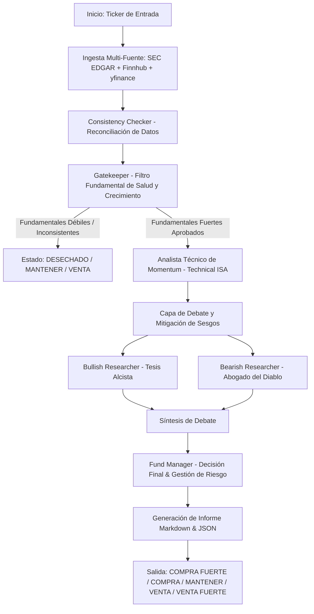

# Plan de Implementación: Sistema Multi-Agente de Análisis Financiero (LangGraph + Docker)

Este proyecto implementa un **Sistema Multi-Agente Financiero de Selección de Élite** basado en el **Patrón de Orquestación Jerárquica con Estados de Control (State Machine)** usando **LangGraph** y **Docker**.

El sistema analiza acciones del mercado bursátil y clasifica cada ticker en una de las 5 categorías requeridas:
1. **COMPRA FUERTE** (Strong Buy)
2. **COMPRA** (Buy)
3. **MANTENER** (Hold)
4. **VENTA** (Sell)
5. **VENTA FUERTE** (Strong Sell)

---

## User Review Required

> [!IMPORTANT]
> **Proveedor de LLM / Claves de API (Open Source & Multi-provider)**:
> Dado que se trata de un proyecto **Open Source**, el sistema incluirá soporte primario para **Hugging Face** (`langchain-huggingface` / Hugging Face Inference API e Inferencia local de modelos de código abierto como Llama 3, Mistral, Qwen, etc.), además de integración modular con Ollama (100% local), OpenAI (`gpt-4o`/`gpt-4o-mini`), Groq, Google Gemini o Anthropic vía variables de entorno en `.env`. Se garantizará también un modo heurístico de respaldo por si no se provee ninguna clave de API.

> [!NOTE]
> **Fuentes de Datos Financieros Multi-Vendor & Reconciliación**:
> Para garantizar la máxima precisión en el filtro fundamental, la capa de ingesta implementará un enfoque de **Reconciliación Multi-Fuente**:
> 1. **SEC EDGAR API (Oficial)**: Consulta directa de reportes 10-K y 10-Q de la SEC para datos auditados de balances, deuda y estados de resultados.
> 2. **Finnhub API**: Obtención de ratios fundamentales estructurados, perfil de empresa y transacciones de insiders.
> 3. **yfinance & RSS/Noticias Aggregators**: Datos de precios históricos, métricas de mercado y titulares de noticias macroeconómicas/empresariales.
> 4. **Consistency Checker (Verificador de Consistencia)**: Módulo dentro del Gatekeeper que valida y reconcilia métricas clave (ingresos, márgenes, deuda) entre fuentes antes de aprobar el paso a análisis técnico.

---

## Flujo Operativo y Arquitectura de Agentes



### Componentes de la Arquitectura

1. **Ingesta Multi-Fuente & Gatekeeper (Filtro Fundamental + Consistency Checker)**:
   - Extrae métricas de SEC EDGAR API, Finnhub API y yfinance.
   - Reconcilia ingresos, EBITDA, margen neto, Deuda/Capital y ROE mediante el `Consistency Checker`.
   - Evalúa salud financiera. Aplica ramificación condicional explícita en LangGraph: si la empresa no cumple los umbrales o presenta inconsistencias graves, el flujo se detiene (ahorrando cómputo).

2. **Technical ISA (Analista Técnico de Momentum)**:
   - Calcula RSI (14), MACD (12, 26, 9), Bandas de Bollinger (20, 2), SMA 50/200, Volumen relativo y ATR (14).
   - Identifica si el precio está en ruptura alcista, consolidación o tendencia bajista.

3. **Debate Unit (Mitigación de Sesgos)**:
   - **Bullish Researcher**: Defiende la tesis alcista.
   - **Bearish Researcher**: Actúa como "abogado del diablo" para encontrar riesgos ocultos, sobrevaloración o resistencia técnica.

4. **Fund Manager (Decisión Final & Riesgo)**:
   - Integra fundamentales, técnico y síntesis de debate.
   - Determina el tamaño de posición recomendado (% del portafolio) y cálculo de Stop-Loss / Take-Profit basados en ATR.
   - Emite el dictamen final: `COMPRA FUERTE`, `COMPRA`, `MANTENER`, `VENTA`, `VENTA FUERTE`.

5. **Panel Web Interactivo & CLI**:
   - Panel de control moderno (Dashboard en FastAPI + HTML5/CSS Glassmorphism con gráficos interactivos) y CLI para ejecución rápida por lotes.
   - Exportación de informes detallados en Markdown (`daily_selection.md`).

---

## Proposed Changes

### Estructura de Directorios

```
10_Multi_Agent_Financiero/
├── docker-compose.yml
├── Dockerfile
├── requirements.txt
├── .env.example
├── README.md
├── cli.py
├── src/
│   ├── __init__.py
│   ├── config.py
│   ├── state.py
│   ├── data/
│   │   ├── __init__.py
│   │   ├── fetcher.py          # yfinance & Yahoo Finance API
│   │   ├── sec_edgar.py        # Integración oficial con SEC EDGAR API (10-K, 10-Q)
│   │   ├── finnhub_client.py   # Finnhub API para ratios y perfil de empresa
│   │   └── reconciler.py       # Consistency Checker multi-proveedor
│   ├── agents/
│   │   ├── __init__.py
│   │   ├── fundamental.py
│   │   ├── technical.py
│   │   ├── debate.py
│   │   └── fund_manager.py
│   ├── graph/
│   │   ├── __init__.py
│   │   └── workflow.py
│   ├── utils/
│   │   ├── __init__.py
│   │   └── report_generator.py
│   └── web/
│       ├── app.py
│       ├── static/
│       │   ├── css/style.css
│       │   └── js/app.js
│       └── templates/
│           └── index.html
└── tests/
    ├── test_fetcher.py
    ├── test_technical.py
    └── test_workflow.py
```

#### [NEW] [config.py](file:///c:/Users/cterr/Documents/10_Multi_Agent_Financiero/src/config.py)
Configuración general, variables de entorno, llaves API y umbrales financieros predeterminados.

#### [NEW] [state.py](file:///c:/Users/cterr/Documents/10_Multi_Agent_Financiero/src/state.py)
Definición del estado global de LangGraph (`FinancialAnalysisState`) conteniendo los datos brutos, reporte fundamental, reporte técnico, debate, decisión del manager y métricas de riesgo.

#### [NEW] [fetcher.py](file:///c:/Users/cterr/Documents/10_Multi_Agent_Financiero/src/data/fetcher.py)
Módulo de recolección de datos mediante `yfinance`, extracción de balances, ratios, historial de precios e indicadores técnicos de soporte.

#### [NEW] [fundamental.py](file:///c:/Users/cterr/Documents/10_Multi_Agent_Financiero/src/agents/fundamental.py)
Agente Gatekeeper para evaluar salud financiera y crecimiento.

#### [NEW] [technical.py](file:///c:/Users/cterr/Documents/10_Multi_Agent_Financiero/src/agents/technical.py)
Agente técnico para calcular RSI, MACD, Bollinger Bands, medias móviles y ATR.

#### [NEW] [debate.py](file:///c:/Users/cterr/Documents/10_Multi_Agent_Financiero/src/agents/debate.py)
Agentes Bullish y Bearish para contraponer hipótesis de inversión y mitigar sesgos.

#### [NEW] [fund_manager.py](file:///c:/Users/cterr/Documents/10_Multi_Agent_Financiero/src/agents/fund_manager.py)
Agente Director de Fondo para asignación de decisión final de las 5 categorías y reglas de gestión de riesgo.

#### [NEW] [workflow.py](file:///c:/Users/cterr/Documents/10_Multi_Agent_Financiero/src/graph/workflow.py)
Construcción y compilación del StateGraph en LangGraph con enrutamiento condicional.

#### [NEW] [app.py](file:///c:/Users/cterr/Documents/10_Multi_Agent_Financiero/src/web/app.py) & Frontend Web
Interfaz web moderna con diseño dark mode premium, visualización gráfica de resultados y exportador de informes.

#### [NEW] [Dockerfile](file:///c:/Users/cterr/Documents/10_Multi_Agent_Financiero/Dockerfile) & [docker-compose.yml](file:///c:/Users/cterr/Documents/10_Multi_Agent_Financiero/docker-compose.yml)
Aislamiento en contenedores Docker y orquestación reproducible.

---

## Verification Plan

### Automated Tests
- Pruebas unitarias de obtención de datos e indicadores técnicos (`pytest tests/`).
- Pruebas de enrutamiento condicional en la máquina de estados de LangGraph.
- Verificación del resultado del Fund Manager para garantizar que asigna correctamente una de las 5 clasificaciones: `COMPRA FUERTE`, `COMPRA`, `MANTENER`, `VENTA`, `VENTA FUERTE`.

### Manual & System Verification
- Ejecución de CLI con acciones reales (`python cli.py --tickers NVDA,AAPL,TSLA,INTC`).
- Inicio del servidor web FastAPI (`python -m src.web.app`) y verificación visual de la interfaz de usuario.
- Prueba del contenedor Docker vía `docker-compose up --build`.
